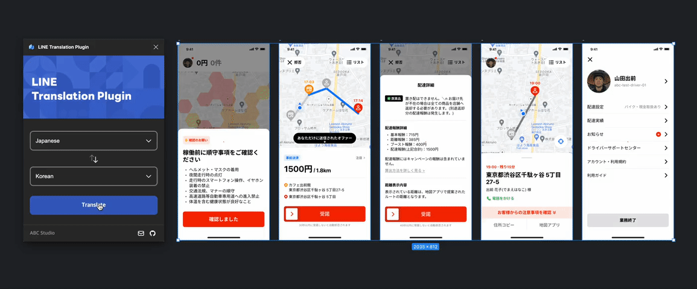

# Figma Translator Vue Plugin Sample



This repository contains the source code for a translation plugin that works in Figma.

The plugin is built using Vue.js, and it allows you to select a text element in Figma and translate that text into the
language of your choice.

Note: that the plugin does not include the translation API functionality itself. You will need to
implement [this part](https://github.com/line/figma-translator-vue-plugin-sample/blob/main/src/code.ts#L65)
yourself. To do this, you can use a third-party translation API, such as Papago API or Google Cloud Translate API.

# Development

You will need to update your `manifest.json` with your plugin's name and ID.

You can get a name and
ID by [create a new plugin](https://www.figma.com/plugin-docs/plugin-quickstart-guide/#create-a-new-plugin).

You can develop this plugin by following these steps:

1. Clone this repository.
2. Install the necessary dependencies.
   ```bash
   npm install
   ```
3. Start the development server.
   ```bash
   npm run start
   ```
4. Test the plugin that is running on the development server.
5. Build the plugin when development is complete.
   ```bash
   npm run build
   ```
6. The final files can be found in the `dist folder.
